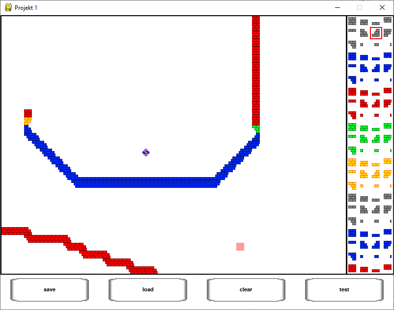
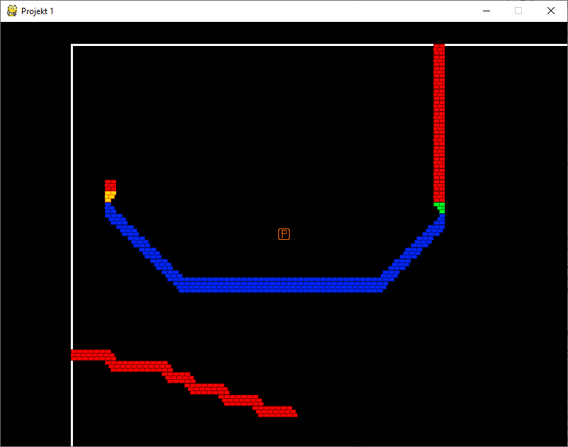

# Platforming Game - Level Editor
> A rough sketch of what was supposed to be an RPGMaker-like map editor for a platformer game i was asked to make as a grade project

## Screenshots

## TODO
* Proper pixel-perfect collision detection
* Actual tilesets, rather than placeholders of the placeholders
* Simple animation for a player and potential enemies
* Actual game objects/enemies support in the editor
